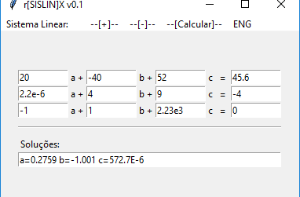

rSisLin[X] - Linear System Solver
---------------------------------

This is a python3/tk software capable of solving up to 10 variables/equations in a Linear System.

Features:
- Up to 10 variables/equations
- Accepts cientific notation, such as: 1E3 = 1000
- Engineering mode or 8 decimal figures precision

Binaries:
- Binaries are provided for Windows 10 - 64bits 

Screenshot
----------

